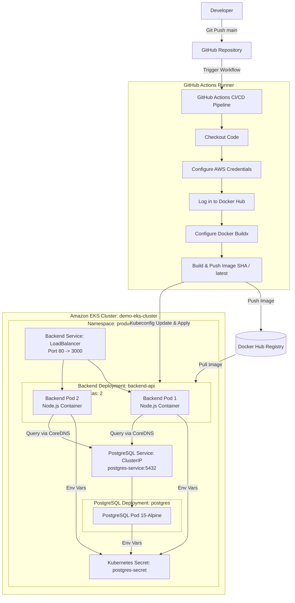
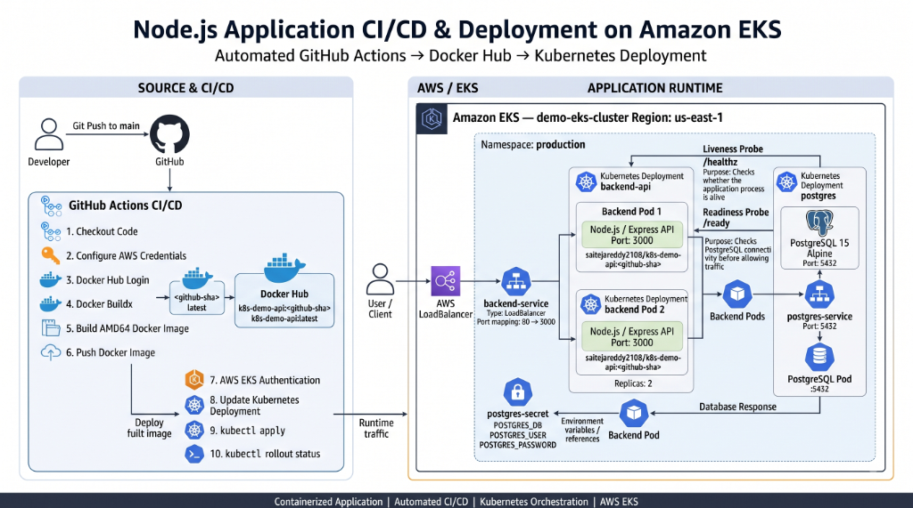
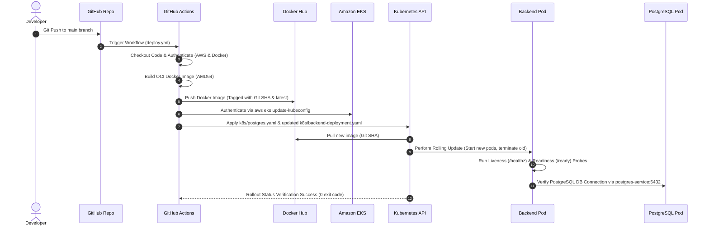
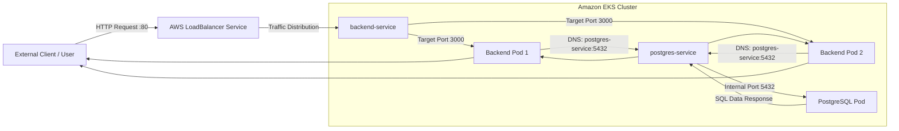
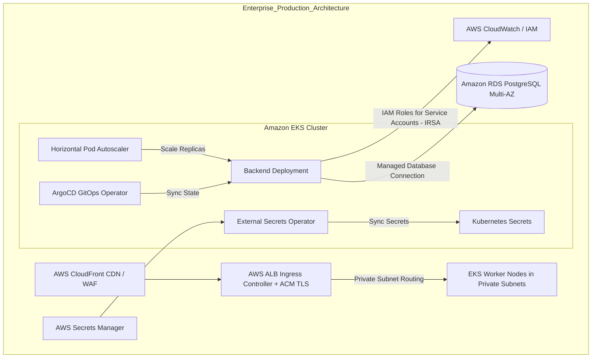

# Production-Style Node.js Application Deployment on Amazon EKS

> A containerized Node.js REST API with a PostgreSQL database, orchestrated using Kubernetes and automatically deployed to **Amazon Elastic Kubernetes Service (Amazon EKS)** through an automated **GitHub Actions** CI/CD pipeline.

---

## 1. Project Overview

This repository demonstrates an end-to-end containerized web application deployment workflow tailored for cloud-native infrastructure. 

The application layer consists of a **Node.js/Express** REST API connected to a **PostgreSQL 15** relational database. The workload is containerized using **Docker**, orchestrated using **Kubernetes** manifests, and hosted on **Amazon EKS** in the `us-east-1` region.

### Core Architectural Decisions

* **Docker**: Ensures consistent, immutable runtime environments across local development, container registry storage, and cluster execution, eliminating "works on my machine" operational discrepancies.
* **Kubernetes (k8s)**: Manages container deployment, service discovery, self-healing (liveness/readiness health probes), declarative resource management (CPU/memory constraints), and zero-downtime rolling updates.
* **Amazon EKS**: Provides a managed, high-availability Kubernetes control plane integrated with AWS infrastructure.
* **PostgreSQL on Kubernetes**: Deployed as an in-cluster stateful workload with dedicated service discovery (`postgres-service`) for lightweight database requirements.
* **GitHub Actions**: Automates the entire CI/CD lifecycle—from source code checkout, multi-architecture Docker image builds, and Docker Hub image publishing to automated EKS cluster authentication, deployment manifest updates, and rollout verification.

---

## 2. Architecture



---

## 3. Architecture Diagram Visual



*The diagram above illustrates the structural interaction between the developer workflow, GitHub Actions CI/CD pipeline, Docker Hub container registry, Amazon EKS cluster architecture, Kubernetes services, pod deployments, secret configuration, and internal network traffic routing.*

---

## 4. Technology Stack

| Category | Technology | Description |
| :--- | :--- | :--- |
| **Cloud Provider** | AWS (Amazon Web Services) | Managed Cloud Infrastructure |
| **Kubernetes Platform** | Amazon EKS (`demo-eks-cluster`) | Managed Kubernetes Control Plane (`us-east-1`) |
| **Containerization** | Docker / Docker Buildx | OCI Container Engine & Multi-arch Builder |
| **Container Registry** | Docker Hub | Remote Public Container Image Storage |
| **Application Layer** | Node.js / Express.js | Backend REST API Framework |
| **Database Layer** | PostgreSQL 15 (Alpine) | In-Cluster Relational Database |
| **CI/CD Automation** | GitHub Actions | Automated Build, Packaging & Deployment Pipeline |
| **Orchestration** | Kubernetes | Declarative Workload & Service Orchestration |
| **Configuration Management** | Kubernetes Secrets | In-cluster Sensitive Environment Variable Storage |

---

## 5. Repository Structure

```text
.
├── .github/
│   └── workflows/
│       └── deploy.yml          # GitHub Actions CI/CD pipeline configuration
├── k8s/
│   ├── backend-deployment.yaml # Kubernetes Deployment & Service for Node.js API
│   └── postgres.yaml           # Kubernetes Secret, Deployment & Service for PostgreSQL
├── docs/
│   └── images/                 # Architectural & flow diagrams
│       ├── architecture.png
│       ├── cicd-pipeline.png
│       └── kubernetes-flow.png
├── .gitignore                  # Git tracking exclusion list
├── Dockerfile                  # Multi-stage production container build instructions
├── app.js                      # Express application source code & API endpoints
├── package.json                # Node.js project manifest & runtime dependencies
└── README.md                   # Project documentation
```

### File Breakdown

* [`.github/workflows/deploy.yml`](file:///.github/workflows/deploy.yml): Automates testing, Docker image creation, AWS authentication, EKS deployment, and rollout status validation upon git push.
* [`k8s/backend-deployment.yaml`](file:///k8s/backend-deployment.yaml): Defines the 2-replica `backend-api` deployment, container ports, environment secret mappings, health probes (`/healthz`, `/ready`), resource limits, and the public-facing `LoadBalancer` service.
* [`k8s/postgres.yaml`](file:///k8s/postgres.yaml): Defines `postgres-secret`, the single-replica PostgreSQL 15 deployment with resource limits, and the internal `ClusterIP` service (`postgres-service`).
* [`Dockerfile`](file:///Dockerfile): Lightweight OCI container build instructions utilizing Node.js Alpine base, non-root execution, and explicit container startup.
* [`app.js`](file:///app.js): Node.js Express API containing core application endpoints, PostgreSQL driver connections (`pg`), and container health monitoring handlers.

---

## 6. Application Architecture

The Node.js Express application exposes three primary HTTP endpoints engineered specifically to interface with Kubernetes health monitoring and workload evaluation:

### Endpoints

#### 1. Liveness Probe (`GET /healthz`)
* **Purpose**: Used by the Kubernetes Kubelet liveness probe to verify whether the container process is responsive and healthy.
* **Behavior**: Returns a HTTP `200 OK` response with status text `"OK"`.
* **Failure Handling**: If the process hangs or enters an unrecoverable deadlock, Kubernetes restarts the pod container automatically.

#### 2. Readiness Probe (`GET /ready`)
* **Purpose**: Used by the Kubernetes readiness probe to determine whether the pod is ready to accept user traffic.
* **Behavior**: Executes a lightweight query (`SELECT 1`) against the PostgreSQL database connection pool. Returns `200 OK` when connected, or `500 Internal Server Error` if the database is unreachable.
* **Traffic Isolation**: If PostgreSQL is temporarily unavailable, Kubernetes removes the pod IP from the `LoadBalancer` endpoint pool without restarting the container, preventing failed client requests.

#### 3. Core API Endpoint (`GET /`)
* **Purpose**: Executes a database timestamp query (`SELECT NOW()`) to return a JSON payload containing:
  * Application status message
  * Database server current timestamp
  * Pod hostname (`process.env.HOSTNAME`)
* **Demonstrational Value**: The inclusion of `process.env.HOSTNAME` visually proves Kubernetes round-robin load balancing across the two backend pod replicas as requests are served.

---

## 7. Docker Implementation

The application is containerized using Docker to produce a predictable runtime environment.

### Dockerfile Highlights

```dockerfile
FROM node:18-alpine
WORKDIR /app
COPY package*.json ./
RUN npm install --production
COPY . .
EXPOSE 3000
USER node
CMD ["node", "app.js"]
```

### DevOps Engineering Considerations

* **Minimal Base Image (`node:18-alpine`)**: Reduces the container image footprint, speeds up registry push/pull operations, and minimizes the OS-level attack surface.
* **Layer Caching**: `package.json` and `package-lock.json` are copied and installed *before* copying application source code, leveraging Docker layer caching to accelerate subsequent CI builds.
* **Least Privilege Enforcement (`USER node`)**: Avoids running application processes as `root` inside the container, adhering to container security best practices.
* **Explicit Port Exposure (`EXPOSE 3000`)**: Documents the container network interface boundary clearly.

---

## 8. Kubernetes Architecture

All resources are deployed isolated within the dedicated `production` Kubernetes namespace.

```yaml
apiVersion: v1
kind: Namespace
metadata:
  name: production
```

### Backend Deployment (`backend-api`)
* **Replicas**: 2 (Ensures pod-level redundancy across node failure domains).
* **Network Binding**: Listens on container port `3000`.
* **Health Probes**:
  * **Liveness Probe**: `GET /healthz` (Initial delay: 5s, Period: 10s).
  * **Readiness Probe**: `GET /ready` (Initial delay: 10s, Period: 5s).
* **Resource Management**:
  * `requests`: `100m` CPU, `128Mi` Memory (Guaranteed baseline allocation).
  * `limits`: `250m` CPU, `256Mi` Memory (Prevents container resource starvation).
* **Environment Variable Injection**: Extracts database credentials dynamically from `postgres-secret` using `secretKeyRef`.

### Backend Service (`backend-service`)
* **Type**: `LoadBalancer`
* **Port Mapping**: External Port `80` $\rightarrow$ Target Port `3000`
* **Function**: Instructs AWS EKS to provision a cloud Network/Application Load Balancer exposing the `backend-api` pod endpoints to external traffic.

### PostgreSQL Deployment (`postgres`)
* **Replicas**: 1 (Single instance stateful container execution).
* **Image**: `postgres:15-alpine`
* **Port Binding**: Container port `5432`.
* **Resource Management**:
  * `requests`: `150m` CPU, `256Mi` Memory.
  * `limits`: `300m` CPU, `512Mi` Memory.
* **Environment Variables**: Dynamically maps `POSTGRES_DB`, `POSTGRES_USER`, and `POSTGRES_PASSWORD` from `postgres-secret`.

### PostgreSQL Service (`postgres-service`)
* **Type**: `ClusterIP` (Internal only)
* **Port**: `5432`
* **Function**: Provides stable internal DNS resolution (`postgres-service.production.svc.cluster.local`) for the backend pods, abstracting away underlying ephemeral pod IP changes.

---

## 9. Secrets and Configuration

Database credentials are managed declaratively using a Kubernetes Secret resource:

```yaml
apiVersion: v1
kind: Secret
metadata:
  name: postgres-secret
  namespace: production
type: Opaque
stringData:
  POSTGRES_DB: devdb
  POSTGRES_USER: devuser
  POSTGRES_PASSWORD: devpassword
```

Both `postgres` and `backend-api` deployments reference this secret via `secretKeyRef`, decoupling configuration data from application code.

> [!NOTE]
> **Production Improvement**: Hardcoding secret values inside raw Git-committed Kubernetes manifests is suitable for local/demo repositories only. In an AWS enterprise environment, secrets should be stored in **AWS Secrets Manager** or **HashiCorp Vault** and synchronized into EKS using the **External Secrets Operator (ESO)** or **Secrets Store CSI Driver**.

---

## 10. CI/CD Pipeline

The deployment pipeline is fully automated using GitHub Actions defined in [`.github/workflows/deploy.yml`](file:///.github/workflows/deploy.yml).


### Pipeline Stages

1. **Step 1 — Source Trigger**: Triggers automatically on any `git push` targeting the `main` branch.
2. **Step 2 — Code Checkout**: Utilizes `actions/checkout@v3` to fetch the source repository onto the runner.
3. **Step 3 — AWS Authentication**: Configures IAM authentication against AWS using `aws-actions/configure-aws-credentials`.
4. **Step 4 — Docker Authentication**: Authenticates to Docker Hub using `docker/login-action@v2` with repository secrets (`DOCKER_USERNAME`, `DOCKER_PASSWORD`).
5. **Step 5 — Docker Buildx**: Initializes Docker Buildx via `docker/setup-buildx-action` for multi-stage building.
6. **Step 6 — Image Build**: Compiles the AMD64 container image from the project `Dockerfile`.
7. **Step 7 — Image Registry Publishing**: Pushes the compiled image to Docker Hub tagged with both immutable Git Commit SHA (`${{ github.sha }}`) and `latest`.
   * *DevOps Best Practice*: Tagging with the unique Git SHA ensures clear auditability, rollbacks, and prevents unintended deployment of cached `latest` tags.
8. **Step 8 — Amazon EKS Authentication**: Updates local `kubeconfig` using the AWS CLI:
   ```bash
   aws eks update-kubeconfig --name demo-eks-cluster --region us-east-1
   ```
9. **Step 9 — Dynamic Image Deployment**: Updates the container image reference in [`k8s/backend-deployment.yaml`](file:///k8s/backend-deployment.yaml) with the exact Git SHA tag and applies manifests to the EKS cluster:
   ```bash
   sed -i 's|YOUR_DOCKERHUB_USERNAME/k8s-demo-api:latest|${{ secrets.DOCKER_USERNAME }}/k8s-demo-api:${{ github.sha }}|g' k8s/backend-deployment.yaml
   kubectl apply -f k8s/postgres.yaml
   kubectl apply -f k8s/backend-deployment.yaml
   ```
10. **Step 10 — Automated Rollout Verification**: Monitors deployment status and enforces pipeline failure if pod updates fail to stabilize within 60 seconds:
    ```bash
    kubectl rollout status deployment/backend-api -n production --timeout=60s
    ```

---

## 11. End-to-End Deployment Flow



### Step-by-Step Execution Sequence

1. Developer commits and pushes changes to the repository's `main` branch.
2. GitHub triggers the `CI/CD Deployment Pipeline` workflow.
3. GitHub Actions runner checks out code and authenticates with AWS and Docker Hub.
4. Docker Buildx compiles the application binary into an OCI container image.
5. Container image is uploaded to Docker Hub with tags `${{ github.sha }}` and `latest`.
6. Pipeline authenticates against the AWS EKS cluster `demo-eks-cluster` in `us-east-1`.
7. Manifest image placeholders are replaced dynamically with the immutable Git commit SHA.
8. `kubectl apply` submits updated secret, deployment, and service configurations to Kubernetes.
9. Kubernetes initiates a rolling deployment, creating new backend pods while pulling the target image tag.
10. Container readiness probes execute `/ready` to establish active PostgreSQL TCP pool connectivity.
11. Upon successful probe completion, Kubernetes attaches new pod IPs to the `backend-service` LoadBalancer.
12. Old backend pods are gracefully terminated without dropping active client connections.
13. External HTTP clients send requests through the AWS LoadBalancer, routed round-robin to backend pods, which query `postgres-service:5432` and return responses.

---

## 12. Kubernetes Request Flow




---

## 13. Reliability & Self-Healing Features

The current implementation leverages built-in Kubernetes primitives to guarantee service availability and resilience:

* **Pod Redundancy (2 Replicas)**: Eliminates single points of failure at the application pod layer.
* **Readiness Probes (`/ready`)**: Prevents traffic from reaching pods before database pools are fully initialized or during database outages.
* **Liveness Probes (`/healthz`)**: Automatically detects deadlocked node processes and instructs Kubelet to restart unresponsive containers.
* **Resource Bounds (Requests & Limits)**: Enforces explicit memory and CPU boundaries to avoid noisy-neighbor syndrome and out-of-memory (OOM) cluster instability.
* **Service Abstraction (`ClusterIP`)**: Abstracted DNS discovery (`postgres-service`) handles automatic re-routing if the database pod is rescheduled onto a different worker node.
* **Rollout Verification**: Pipeline enforces automated rollback/failure notifications if a newly deployed image crashes on startup.

---

## 14. Production Improvements

To transition this architecture from a production-style deployment to an enterprise production standard, the following operational enhancements are recommended:



### Architectural Roadmap

1. **Managed Database (Amazon RDS for PostgreSQL)**: Replace the single-node in-cluster PostgreSQL pod with a managed multi-AZ Amazon RDS instance featuring automated backups, replication, and failover.
2. **External Secret Management**: Integrate **AWS Secrets Manager** with **External Secrets Operator (ESO)** or **Secrets Store CSI Driver** to eliminate credentials from source control and raw manifests.
3. **IAM Roles for Service Accounts (IRSA)**: Utilize AWS IRSA to grant Kubernetes pods fine-grained AWS IAM permissions using OpenID Connect (OIDC) instead of static worker node IAM credentials.
4. **Private Network Topology**: Restrict EKS worker nodes to private subnets with NAT Gateways, exposing the cluster strictly via an **AWS Application Load Balancer (ALB) Ingress Controller** with TLS termination via AWS Certificate Manager (ACM).
5. **Horizontal Pod Autoscaling (HPA)**: Configure HPA based on CPU/memory utilization metrics from Metrics Server to scale backend pod replicas dynamically during traffic spikes.
6. **Container Security & Vulnerability Scanning**: Integrate security tools like **Trivy** or **AWS ECR Image Scanning** into the GitHub Actions pipeline to block vulnerable images prior to deployment.
7. **GitOps Deployment Paradigm**: Transition from imperative `kubectl apply` in CI/CD to a declarative GitOps engine like **ArgoCD** or **FluxCD** for continuous reconciliation.
8. **Observability Stack**: Deploy **Prometheus & Grafana** alongside **Fluentbit** for centralized logging and real-time metric visualization.

---

## 15. Key DevOps Concepts Demonstrated

* **Immutable Container Infrastructure**: Building and tagging container images with unique Git commit SHAs.
* **Cloud-Native Container Orchestration**: Managing application deployments, services, networking, and state through declarative Kubernetes YAML manifests.
* **Continuous Integration & Delivery (CI/CD)**: Automating code linting, packaging, registry distribution, and cluster deployment via GitHub Actions.
* **Service Discovery & Internal DNS**: Utilizing Kubernetes CoreDNS and ClusterIP abstractions for inter-workload communication.
* **Automated Health Monitoring**: Implementing synthetic application readiness and container liveness probes.
* **Declarative Resource Allocation**: Enforcing strict CPU and Memory requests/limits for runtime stability.
* **Self-Healing Workloads**: Relying on Kubernetes controllers for automatic pod restarts and zero-downtime rolling updates.

---

## 16. Skills Demonstrated

* **Cloud Infrastructure**: AWS, Amazon EKS, AWS CLI authentication, IAM security context.
* **Container Management**: Docker, Dockerfile multi-stage optimization, Docker Buildx, Docker Hub registry operations.
* **Kubernetes Orchestration**: Deployments, Services (LoadBalancer & ClusterIP), Namespaces, Secrets, Liveness/Readiness Probes, Resource Management.
* **CI/CD Automation**: GitHub Actions pipeline construction, secret management, multi-platform build setup, dynamic manifest replacement (`sed`), automated rollout validation (`kubectl rollout`).
* **Application Engineering**: Node.js, Express.js REST API design, PostgreSQL client connection pooling (`pg`), container health probe integration.

---

## 17. How to Deploy

### Prerequisites

1. An active **AWS Account** with an initialized **Amazon EKS cluster** named `demo-eks-cluster` in `us-east-1`.
2. A **Docker Hub Account** for storing container images.
3. `aws-cli`, `kubectl`, and `docker` installed on your local workstation.

### Required GitHub Secrets

Configure the following repository secrets under **Settings $\rightarrow$ Secrets and variables $\rightarrow$ Actions**:

* `AWS_ACCESS_KEY_ID`: AWS IAM User access key with EKS deployment permissions.
* `AWS_SECRET_ACCESS_KEY`: AWS IAM User secret key.
* `DOCKER_USERNAME`: Docker Hub username.
* `DOCKER_PASSWORD`: Docker Hub password or access token.

### Manual Local Deployment

To deploy manually from your local terminal:

```bash
# 1. Update local kubeconfig for Amazon EKS
aws eks update-kubeconfig --name demo-eks-cluster --region us-east-1

# 2. Create production namespace
kubectl apply -f - <<EOF
apiVersion: v1
kind: Namespace
metadata:
  name: production
EOF

# 3. Apply PostgreSQL resources & secret
kubectl apply -f k8s/postgres.yaml

# 4. Apply Backend deployment & service
kubectl apply -f k8s/backend-deployment.yaml

# 5. Verify deployment rollout status
kubectl rollout status deployment/backend-api -n production --timeout=60s

# 6. Retrieve LoadBalancer external IP
kubectl get svc backend-service -n production
```

---

## 18. Conclusion

This project demonstrates a practical, production-style cloud engineering workflow. By combining Node.js microservices with PostgreSQL on Amazon EKS, automated via GitHub Actions, it demonstrates core DevOps methodologies—including automated container builds, immutable deployment tagging, secret management, cloud service discovery, self-healing health checks, and zero-downtime rolling updates.
